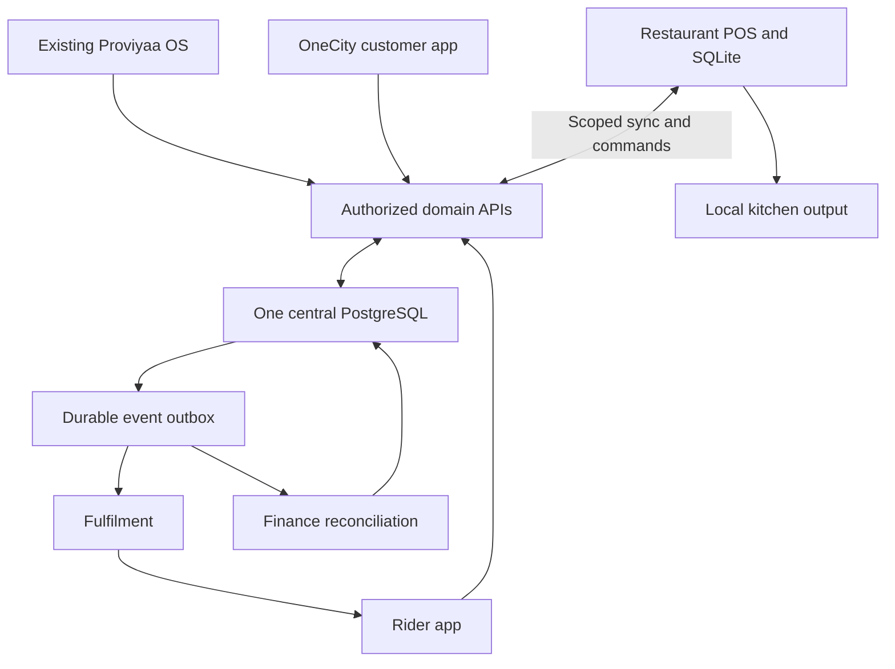
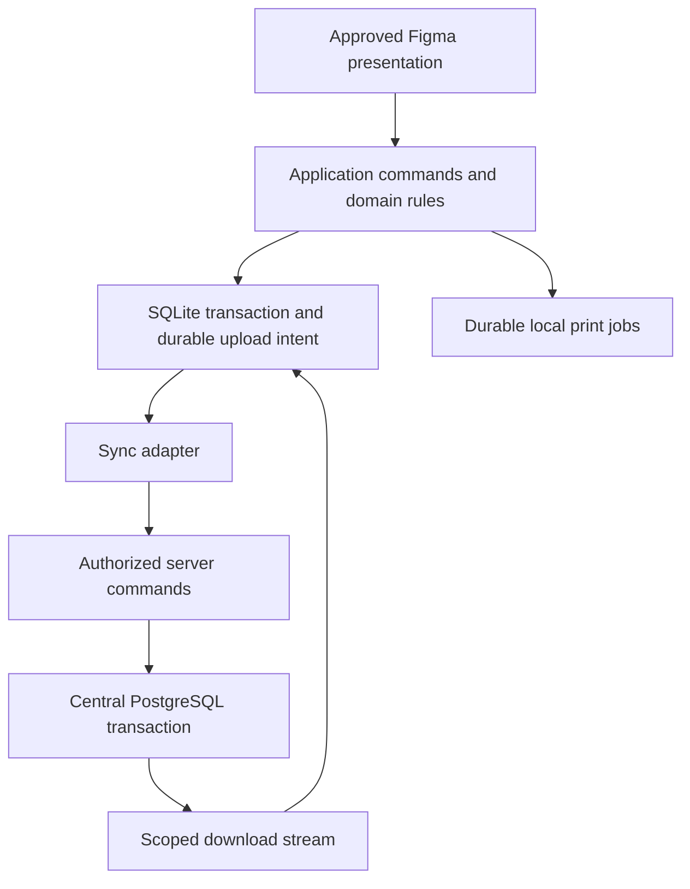

# Day 3 / PRD-03 — Restaurant POS in the Proviyaa ecosystem
## v4 — new product proposal for owner review

Author: Codex. Status: **review draft, not authorization to implement**.
This is a fresh Restaurant POS PRD, replacing v3 as the proposed reading document. Earlier files remain historical; their text is not attributed to this author. “Day 3” is a product chapter, not a promise to build this in one day. It is also not the older document named prd-03-commerce-os.md: Commerce is a shared domain, Restaurant POS is an application.

## 1. Abstract — what we are actually building

Proviyaa OS, in the existing Repo-1- repository, is the business control centre. It acquires a restaurant, records what was promised, configures what the restaurant can use, and oversees onboarding and ongoing operations. This chapter does not rebuild that website. It defines a **new restaurant operator application**, connected to that OS and the existing central database.

The Restaurant POS is where a real restaurant runs its shift: staff sign in, see tables and menu, take walk-in orders, receive online orders, send kitchen instructions, collect or reconcile payment, and close the day. It must remain usable when internet connectivity disappears. It should feel like one application, not an “online product” and an “offline product” between which staff must switch.

All products share one central Supabase PostgreSQL business system. Sharing a database does not mean sharing unrestricted access: restaurant A cannot see restaurant B, a cashier cannot issue arbitrary refunds, and a rider cannot read merchant finance. Each domain owns its writes through authorized commands. The POS additionally holds a restricted SQLite database on its device. That local database stores the working restaurant data and unsent actions; it is not a second independent business backend.

**When internet is available, POS still operates locally and synchronizes in the background.** A cashier can be entering a walk-in order while a OneCity order arrives from the cloud. Both appear in the same restaurant queue with different origin labels. When disconnected, local selling continues, but newly placed internet orders cannot magically reach that device. The cloud must stop promising immediate restaurant acceptance once the location loses its receiving connection.

Before this chapter, the OS must provide an organization, location, membership, permitted features and a configuration snapshot; the shared commerce foundation must provide agreed order/payment identities. After this chapter, OneCity submits customer orders through that commerce foundation, and fulfilment hands prepared orders to the rider system. Those future applications do not require separate restaurant order or payment databases.

Finance connects the whole journey: what was charged, who collected it, what is verified, what is refundable, what the merchant is owed, and what cash a rider must remit. A completed delivery is not automatically a settled payment. A locally recorded payment is not automatically provider-verified. This distinction is part of the first architecture, even where actual payouts arrive in a later phase.

The first useful deliverable is a single-location, single-primary-device restaurant POS that can complete a cash sale and kitchen ticket without internet, then synchronize without duplication. The next deliverable connects one OneCity order and one rider delivery through the same records. Full marketplace, dispatch and financial automation are not prerequisites to proving the first local sale.

## 2. Decisions, proposals and unknowns

| Category | Position |
|---|---|
| User decision | Existing repo is Proviyaa OS/configurator; new POS is a separate product |
| User decision | Keep the existing central database; use Supabase PostgreSQL |
| Proposed architecture | SQLite local working store, same local command path online and offline |
| Proposed first scope | One primary selling device per location; direct local kitchen printer or same-device kitchen screen |
| Proposed sync choice | Evaluate PowerSync first; choose one sync implementation, not PowerSync plus a second competing queue |
| Not yet approved | Target OS/device, printer model, sync deployment/cost, offline authorization duration |
| Missing evidence | Approved Figma URLs/node IDs and current deployed database schema |
| Not claimed | The screenshot references were inspected; no image-based requirements are verified in this revision |
| Review question | Is standalone multi-terminal operation during an internet outage required at first release? If yes, local network coordination becomes required scope |

PowerSync officially documents Supabase-to-SQLite synchronization, locally persisted writes and upload queuing. This supports the proposed connected/local-first pattern, but does not remove our responsibility for payment validation, authorization or conflict rules. [Official integration guide](https://docs.powersync.com/integrations/supabase/guide).

## 3. Where Day 3 fits

| Stage | Product / domain | Output handed onward |
|---|---|---|
| Before POS: sell and onboard | Existing Proviyaa OS | Confirmed requirements, organization/location, staff, subscription/entitlement, published settings |
| Before POS: shared foundation | Central commerce and identity | Canonical IDs, scoped permissions, catalogue/order/payment contracts |
| This chapter | New Restaurant POS | Local orders, KOTs, payment evidence, shift closure and synchronized operations |
| Connect customer demand | OneCity customer app | Customer order into the same central order model |
| Connect physical fulfilment | Fulfilment and rider app | Job linked to order, pickup, delivery proof and cash collection evidence |
| Complete commercial lifecycle | Shared finance inside central system | Reconciliation, merchant payable, fees, refunds, settlement and audit |
| Ongoing oversight | Proviyaa OS | Configuration, support, access policy, financial and operational health |

Terminology: the **restaurant organization is the tenant**. OneCity is the customer-facing application, not a tenant database. Its customers may shop across tenants but see only their own authorized orders.

### Ecosystem connections

These boxes are responsibility boundaries. The MVP can use one backend deployment and one database; it does not need microservices or five independent backends.

## 4. Core modules and source requirements

Source IDs below refer to the supplied converted documents, previously read in this conversation. Local attachments are unavailable to reread in this turn; these are section-level references, not invented DOCX page citations. This table is a relevant requirement extract, not a claim that full original documents have been bundled into this repo.

- **S1:** Product Flow, section 7, engineering Phases 0–3, 5, 7–10; section 6 capability version model.
- **S2:** Product Architecture, sections 2–3 (“Five Master Truths”), 7–10 (journey and control plane).
- **S3:** viyaa routes, sections 3–9 (control, subscription, shared commerce, identity and POS), 10–11 (customer and delivery).

| ID / core module | What it means in this product | First local slice / later activation | Source |
|---|---|---|---|
| R01 Identity, staff and device | Staff role, location, enrolled device, shift access | Active | S1 Phase 1; S3 §§7–9 |
| R02 Configuration | Published modules, settings, roles, layout tokens and workflow preset | Consume existing OS; minimal adapter | S2 §§8–10; S3 §§3–5 |
| R03 Menu | Categories, items, variants/modifiers, availability and price snapshot | Active basic menu/modifiers | S1 Phase 5; S3 §9 |
| R04 Selling | Dine-in, takeaway, local delivery order; lines, notes and totals | Active local cash sale | S3 §9 |
| R05 Tables and service | Table occupancy, dining session, open bill | Basic active; advanced reservations later | S1 Phase 5; S3 §9 |
| R06 Kitchen | KOT, station routing, preparation and ready status | Active local output; separate connected KDS later | S1 Phase 5; S3 §9 |
| R07 Orders | One order model, origin, status history, cancellations and exceptions | Active local; OneCity adapter next | S2 §3; S3 §6 |
| R08 Payments and finance | Payment evidence, cash shift, refund request, reconciliation projection | Cash/shift active; provider/payout integrations later | S1 Phase 3; S3 §6 |
| R09 Inventory | Shared inventory projection; ingredients, recipes, wastage | Interfaces registered; detailed movements later | S1 Phase 5 explicitly forbids separate restaurant inventory engine |
| R10 Purchasing | Suppliers, purchase and receiving interfaces | Registered/deferred | S1 Phase 5 |
| R11 Customers and growth | Customer reference, CRM, loyalty, promotions | Optional customer reference first; advanced later | S3 §§6,9 |
| R12 Reports | Local shift sales and unsynced totals; central consolidated reports | Basic active; intelligence later | S1 Phases 5–6 |
| R13 Fulfilment | Ready-for-pickup handoff and delivery status | Contract first, live adapter later | S1 Phases 7–8; S3 §11 |
| R14 Reliability and audit | Sync health, immutable operation history, backups and access evidence | Active foundation | S1 Phases 0–1 |

Architecture breadth means stable boundaries and registered requirements. It does not require speculative tables for every future feature. Additive migrations are expected as requirements mature.

## 5. One central PostgreSQL, clearly segregated responsibilities

Keep existing table names/IDs where compatible. The following are logical ownership groups, not instructions to rename the current schema or rebuild it:

| Owner | Central records | Who may issue changes |
|---|---|---|
| Platform/OS | organizations, locations, memberships, entitlement/config versions, devices | Authorized platform/merchant administration |
| Commerce | catalogue, customers, orders, lines, price snapshots | Commerce commands called by POS or OneCity |
| Restaurant | table sessions, kitchen tickets, preparation history | Scoped restaurant commands |
| Finance | payment attempts, confirmations, refunds, financial entries, settlement batches | Validated finance/payment commands |
| Fulfilment | jobs, assignments, pickup/proof/delivery history | Fulfilment and rider commands |
| Sync/audit | command receipts, events, checkpoints, device health | Server-controlled infrastructure |

Use organization/location scoping, RLS and server-side action checks. A sync service must independently enforce its download scopes; do not assume a replication connection automatically inherits end-user RLS. No device receives service-role credentials, other merchants’ records or unrestricted financial tables.

PostgreSQL is the **central reconciled record**. Unsynced SQLite transactions are real local records awaiting validation, not disposable cache. Do not erase them on logout, config failure or subscription suspension.

## 6. Can POS be online and offline at the same time?

Yes: it is **always local-first and optionally connected**. “Offline” describes connection state, not a different codebase or write path.

1. Cashier performs an action.
2. One local transaction saves the operation and durable upload intent.
3. The UI shows success as “saved on this device”, even without internet.
4. While connected, the sync worker submits pending commands and receives server results.
5. Downloaded changes update the local projection and UI.
6. The UI distinguishes local, syncing, synchronized, rejected and needs-review states.

Never write the same user action separately to SQLite and PostgreSQL from the UI. That creates duplicate/inconsistent paths. The server may reject a local command; rejection creates a visible reconciliation issue rather than silently deleting the sale.

| Situation | Required behavior |
|---|---|
| Connected POS, walk-in sale | Local save followed by background upload |
| Connected POS, OneCity order | Cloud order downloads, appears as awaiting restaurant acceptance |
| Offline POS, walk-in sale | Local sale and local kitchen output continue |
| Offline POS, new OneCity order | Cloud cannot claim restaurant acceptance; use reachability timeout and pause ordering or explicit pending state |
| Internet down but LAN up | Direct LAN printer can work; separate KDS needs a deliberately built LAN bridge |
| Two disconnected POS devices | Cannot promise shared table/order consistency without local coordination |
| Reconnection | Upload retries and download catch-up; show conflicts and lag |

V1 restricts offline editing to the primary enrolled selling device. Cloud changes to a POS-owned open order use version checks and approved commands, not unrestricted last-write-wins. If multiple offline cashiers are required, stop and revise topology before implementation.

## 7. POS architecture and bootstrap

Proposed stack: Flutter device app, embedded SQLite, Supabase Auth/PostgreSQL, existing web backend for control and authorized APIs. First test PowerSync on the chosen target; pin versions after the spike. If selected, use its supported queue/projection lifecycle, not an additional custom competing sync engine. A custom outbox remains an alternative requiring a separate approved architecture decision and tests.

Installation creates a fresh device-local DB using versioned initialization/migrations. Secure online enrollment binds device, organization and location and loads permitted menu/configuration. Later startup can use the cached offline grant and local staff unlock. New cloud authentication and password resets require connectivity.

Reuse schema definitions and migrations across clients, not populated DB files. App upgrades preserve pending operations and are tested for interrupted migration and recovery. Existing central production DB gets a backup/restore test and staging migration before any modification.

Local data includes menu/config projections, active/recent scoped orders, KOTs, payments, shifts, print jobs, pending upload state and checkpoints. Finance history beyond operational need stays central.

## 8. OS configurator → restaurant operation

The existing OS remains the place to sell and configure the product:

Sales requirement → confirmed disposition → organization/location → permitted features → approved restaurant preset → settings preview → approved version → device enrollment → test sale and kitchen output → training evidence → go live.

Example: restaurant A uses pay-first takeaway; restaurant B uses table-service/pay-later. Both run the same POS application. The OS chooses a validated preset, permitted channels, kitchen routing and roles. It does not inject client-specific code or schema.

Each active order retains the configuration and pricing version under which it began. A new published version normally affects new orders. Runtime invariants—tenant boundaries, financial evidence, audit and valid states—cannot be disabled by configuration.

The prior audit found workflow/module/role configuration and onboarding primitives in the repo, not proof that the entire publish/enroll/acknowledge lifecycle is implemented. Build only missing adapters and safeguards. Never treat an earlier PRD sentence as deployed evidence.

## 9. Order, rider and finance end to end

### Walk-in cash example

Cashier opens shift → creates order locally → sends KOT locally → collects cash and records receipt → kitchen completes → shift closes locally. After sync, central finance sees the same sale/payment IDs. Shift expected cash equals opening float plus cash receipts minus approved cash refunds and paid-outs. Counted cash is recorded separately; variance needs explanation.

### OneCity prepaid delivery example

OneCity creates central order/payment attempt → provider confirmation is recorded → POS receives order and explicitly accepts → kitchen prepares → fulfilment creates/updates one linked job → rider accepts and confirms pickup → delivery proof closes fulfilment → finance reconciles collection, fees, merchant payable and any refund.

Payment before restaurant acceptance requires a timeout/refund or authorization/capture policy. This must be approved for the selected payment provider before enabling real customer payments.

### Cash-on-delivery example

Order remains unpaid while being prepared/delivered. Rider records cash collection against the assigned job and payment reference. Finance records rider cash custody and later remittance separately. Delivery proof alone must never mark cash remitted to the merchant/platform.

### Finance requirements

- Separate order, kitchen, delivery, payment and settlement states; do not overload one status.
- Amounts use integer minor units with currency and explicit rounding rules. Capture price, tax, discount and fee components per sale.
- Provider confirmations are server-verified and deduplicated. A screenshot, manually entered UPI reference or offline “paid” tap is not provider verification.
- Offline cash receipt is permitted; digital payment evidence may be pending verification.
- Financial postings use balanced, immutable entries or a validated equivalent ledger model; corrections are reversals, never edits to settled history.
- POS shows local provisional totals and central reconciled totals with last-sync time.
- Refunds refer to original payment, have authorization and idempotency, and remain pending until provider outcome where applicable.
- Subscription fees owed to Proviyaa are distinct from customer food-sale payments.
- Merchant payable and platform/rider fees derive from explicit commercial rules; no invented fee percentages.
- Do not execute settlement payouts until reconciliation is approved and required evidence exists.
- Final tax/invoice/settlement treatment requires business and finance approval; this PRD does not assert jurisdiction-specific compliance.

## 10. Integration contracts — proposals, not existing endpoints

All writes must resolve tenant/location/actor server-side. Requests carry command ID, schema version, correlation ID and expected record version. Server stores a receipt and business mutation atomically. Retry with the same ID and same payload returns the original result; same ID/different payload is rejected.

| Handoff | Proposed command / result |
|---|---|
| OS → POS | Device bootstrap returns device grant, config version and scoped initial sync |
| POS → Commerce | Submit command batch: per-command accepted, duplicate, rejected or conflict |
| OneCity → Commerce | Create order with client idempotency key; result is placed, not restaurant-accepted |
| POS → Commerce | Accept/reject order with expected version and reason |
| POS → Kitchen | Create durable KOT/print job with unique ticket ID |
| Kitchen → Fulfilment | Ready event with order/location/ticket references |
| Fulfilment → Rider | Job assignment with limited customer/pickup details |
| Rider → Fulfilment | Pickup/delivery proof command; cannot change prices or restaurant lines |
| Payments → Finance | Verified collection/refund event with provider reference |
| Finance → OS/POS | Reconciliation/settlement projection; no direct device ledger editing |

Event envelope: event ID, event type/version, organization, location where applicable, aggregate ID/version, correlation/causation IDs, actor, server-recorded time and payload. Device ID applies to device-originated events only.

Proposed events: order.placed, restaurant.order.accepted, kitchen.ticket.created, kitchen.order.ready, fulfilment.job.assigned, delivery.picked_up, delivery.completed, payment.confirmed, refund.confirmed, settlement.reconciled. Version each schema. Emit cloud events through a transactional outbox with idempotent consumers.

Network delivery is at-least-once. Deduplication gives one business effect; do not promise transport-level exactly-once. Printer crash recovery may leave physical output uncertain: provide an explicit audited “reprint” action rather than promise impossible exactly-once paper printing.

## 11. Reliability and security rules

- Locally generated UUIDs for records/commands; display numbering is separate and must not be silently rewritten on an issued receipt.
- Conflicting financial or already-submitted order changes require review, not last-write-wins.
- Cloud catalogue/config is authoritative for new transactions; preserve existing sale snapshots.
- Detect stale device reachability before accepting new online demand. Define heartbeat interval and timeout during review.
- Suspension reaches a disconnected device only after reconnection or local grant expiry; immediate remote offline shutdown is impossible.
- Separate new-sale permission from uploading historic evidence: an access block must not destroy financial recovery.
- Expired offline grant: preserve data and allow designated recovery/finish-open-work behavior; privileged new work is denied.
- Encrypted storage/secure credential handling, device revoke, least-privilege sync scopes, audit and backup/restore are release requirements.
- Initial release must test device restart, duplicate requests, delayed acknowledgements, reordered events, disk full, corrupted backup, clock skew and cross-tenant access.
- Unsynced data lost with a destroyed device cannot be reconstructed from the cloud. Explain this risk and require a tested backup policy.

## 12. Figma and glass

Figma is the approved visual/interaction reference. For each screen attach its node ID, requirement ID and state list: empty, loading, active, offline, syncing, conflict, denied and error. Missing nodes are open decisions, not fabricated visual approval.

Use glass for optional navigation/overlays when readable. Billing totals, payment state, KOT priority and sync warnings require high-contrast stable surfaces. Reduced transparency/motion and keyboard/touch accessibility are mandatory design states. Design changes that alter business behavior require PRD/contract review first.

## 13. Build sequence — start small, connect deliberately

| Phase | Deliverable | Exit condition |
|---|---|---|
| A: approve this chapter | Device/hardware, Figma, source map, sync choice, finance state model | Owner approves open decisions; no production changes |
| B: minimal foundation | Staging DB mapping, secure APIs, device/config bootstrap | Tenant tests and clean enrollment pass |
| C: local restaurant | Menu, table/order, local KOT/print, cash receipt, shift closure | Internet disabled and restart tested |
| D: connected operation | Background upload/download, errors and reconciliation UI | Repeated retries create no duplicate business effects |
| E: incoming customer order | OneCity contract adapter, reachability and acceptance timeout | Online order and walk-in order coexist correctly |
| F: rider and finance | Ready/job/proof, prepaid and COD reconciliation | End-to-end trace balances and exceptions remain visible |
| G: pilot | Real device/printer, design checks, backup/restore, support ownership | Pilot sign-off with rollback evidence |

OneCity and rider may use contract-test clients in E/F until their applications exist; label them as simulators, not completed integrations. Contracts are agreed now; separate product repositories can follow without duplicating the backend.

## 14. Hermes handoff and completion

Roles are responsibilities, not a requirement to launch many agents:
- Product/source owner: approves scope and links requirements.
- Design owner: supplies approved Figma state map.
- Backend/security owner: owns central schema and command rules.
- POS/sync owner: owns local durability and connected behavior.
- Finance/integration reviewer: verifies payment, delivery and reconciliation cases.
- QA/release owner: provides failure tests and pilot evidence.

Each phase hands over commit SHA, schema/contract versions, Figma references, executed tests, unresolved issues and next owner. Repo-1- owns central migrations/contracts until an explicit ownership transfer. New POS repo consumes a pinned contract version; it cannot independently mutate central tables.

This chapter is complete for implementation review when the owner can explain: what arrives from OS, what POS does locally, what is synchronized, what OneCity/rider consume, and where money is verified. The product is complete only after Phase G evidence—not because this document has a score.

## 15. Questions for your review

1. First installation: Windows counter, Android tablet, or another device?
2. Is one primary counter enough first, or must multiple counters and a separate KDS work together without internet?
3. Is the first pilot cash-only, with digital payments verified manually/online later?
4. Which restaurant Figma board is approved?
5. What offline access duration and customer-order acceptance timeout do you want?

## Evidence and limitations

Source restatements: S1 Product Flow; S2 Product Architecture; S3 viyaa routes, sections identified above. Original source copies should be added to the future Hermes context package before implementation; this draft does not claim they are attached here.

Prior code audit baseline: Repo-1- commit 889c5c725c86bde5f1776f28c899e73935d60849. This revision does not claim to re-audit deployment or current database state.
- [OS kernel](https://github.com/loki1514/Repo-1-/blob/889c5c725c86bde5f1776f28c899e73935d60849/supabase/migrations/0016_os_kernel.sql)
- [Existing workflow application](https://github.com/loki1514/Repo-1-/blob/889c5c725c86bde5f1776f28c899e73935d60849/apps/web/src/lib/workflow-apply.ts)
- [Existing web POS data layer](https://github.com/loki1514/Repo-1-/blob/889c5c725c86bde5f1776f28c899e73935d60849/apps/web/src/lib/pos.ts)
